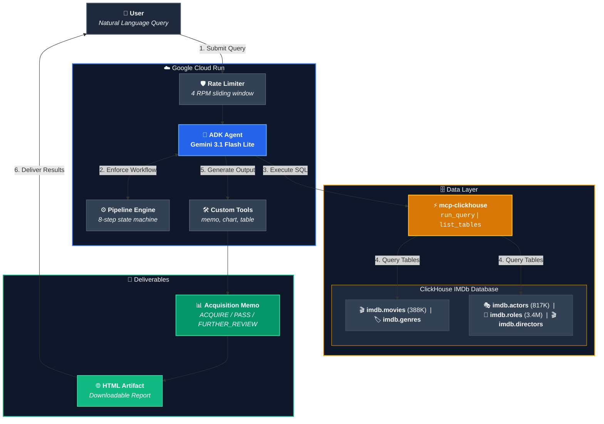

# ScreenScore — Studio Acquisition Analyst

> **Runtime stack:** Google Cloud Run + Google ADK (Gemini 3.1 Flash Lite) + ClickHouse SQL Playground via MCP. Every answer is grounded in live SQL execution against the IMDb dataset — no cached results, no model hallucination.

Built for the [Agentic Cinema: The Blockbuster Hackathon](https://agentic-cinema.devpost.com/) — ClickHouse Track.

---

## What It Does

ScreenScore is a Studio Acquisition Analyst agent. It evaluates film and TV titles for acquisition by executing a deterministic eight-step pipeline against 388K+ IMDb titles in ClickHouse, then produces a structured acquisition memo with a clear recommendation.

**This is the workflow:**

1. Receive a title or acquisition brief in natural language
2. Discover the database schema via MCP
3. Plan and execute ClickHouse SQL queries (ratings, genre benchmarks, director track records, cast analysis)
4. Retrieve recent streaming/box office performance benchmarks
5. Compare the title against historical comps and current slate
6. Validate constraints and generate a downloadable acquisition memo: ACQUIRE / PASS / FURTHER REVIEW

The agent does not answer questions from model memory. Every figure is sourced from a live SQL query.

### Example Queries

- "Evaluate *Anatomy of a Fall* for acquisition — how does it compare to our drama slate?"
- "Show me all A24-distributed films with IMDb rating above 7.5 since 2018 and their genre breakdown"
- "Which directors have the most consistently-rated filmographies over 10+ films?"
- "Compare the rating trajectory of psychological thrillers vs. crime dramas since 2010"
- "Run a full acquisition analysis on *Anora* — director track record, genre comp, recommendation"

---

## Architecture




**Stack:**

| Component | Technology |
|---|---|
| Agent SDK | `google-adk` >= 2.7.0 |
| LLM | Gemini 3.1 Flash Lite |
| MCP Server | `mcp-clickhouse` >= 0.4.1 |
| Database | ClickHouse SQL Playground (IMDb dataset) |
| Deployment | Google Cloud Run |
| Language | Python 3.11 |

---

## Eight-Step Pipeline

The agent follows a deterministic pipeline for every acquisition request:

| Step | Name | What happens |
|---|---|---|
| 1 | SCHEMA | Calls `init_pipeline_state()` + `get_schema_info()` to verify schema |
| 2 | DISCOVER | Calls `list_tables` to confirm available tables |
| 3 | PLAN | Prints numbered query plan before writing SQL |
| 4 | QUERIES | Executes ClickHouse SQL — `run_query` (read-only), with adaptive recovery |
| 5 | ANALYZE | Extracts ratings, genre position, director track record; tracks evidence |
| 6 | COMPARE | Calls `get_title_performance` for streaming benchmarks |
| 7 | VALIDATE | Calls `validate_analysis_constraints()` — enforces all user constraints |
| 8 | DECIDE | Calls `generate_acquisition_memo` — saves ACQUIRE/PASS/FURTHER_REVIEW memo |

---

## Anti-Hallucination Enforcement

The agent enforces strict data provenance at every step:

- **Raw result display:** Every query result is printed verbatim before processing
- **Self-audit:** Before recommendations, each title is verified against raw query output
- **Zero fabrication tolerance:** Any invented title, year, rating, or genre triggers pipeline failure
- **Source labeling:** Every figure labeled `[ClickHouse IMDb]`, `[Synthetic Benchmark]`, `[LLM Inference]`, or `[User-provided]`

---

## Rate Limiting

The agent includes an async sliding-window rate limiter to stay within Gemini free tier quotas:

- **4 requests per minute** (free tier limit: 5 RPM)
- **Retry backoff:** 15s initial, 60s max, 3 attempts
- **Cloud Run timeout:** 600 seconds

---

## Governance

**Read-only database access.** The MCP toolset is configured with `tool_filter=["run_query", "list_databases", "list_tables"]`. Only these three tools are exposed to the agent. `run_query` in the `mcp-clickhouse` server executes SELECT statements only — no INSERT, UPDATE, DELETE, or DDL is possible through this interface.

**Role distinction:**
- **Analyst view:** Full access to SQL results, raw tables, and comparative data
- **Executive view:** Ask the agent to "produce the memo only" — it will skip raw output and return only the structured acquisition memo artifact

**Data provenance.** Every figure in the acquisition memo is traced to a ClickHouse query. If a field is not present in the database (box office revenue, streaming rights, budget), the agent states this explicitly rather than substituting model memory.

---

## Quick Start

### Prerequisites

- Python 3.10+
- Google API key ([get one free](https://aistudio.google.com/apikey))

### Local Development

```bash
git clone https://github.com/YOUR_USERNAME/screenscore.git
cd screenscore

python3 -m venv .venv
source .venv/bin/activate
pip install -r requirements.txt

cp .env.example .env
# Edit .env and add your GOOGLE_API_KEY

adk web --port 8000 .
# Open http://localhost:8000 in your browser
```

### Deployment to Cloud Run

```bash
gcloud auth login
gcloud config set project YOUR_PROJECT_ID
gcloud services enable run.googleapis.com

gcloud run deploy screenscore \
  --source . \
  --region=us-central1 \
  --port=8000 \
  --allow-unauthenticated \
  --memory=512Mi \
  --cpu=1 \
  --timeout=600 \
  --max-instances=1 \
  --set-env-vars="GOOGLE_API_KEY=YOUR_KEY,CLICKHOUSE_HOST=sql-clickhouse.clickhouse.com,..."
```

---

## Project Structure

```
screenscore/
├── screenscore/
│   ├── __init__.py        # ADK module discovery
│   ├── agent.py           # Agent definition + MCP ClickHouse integration + rate limiter
│   ├── prompt.py          # System prompt — 8-step deterministic pipeline
│   ├── tools.py           # Tools: acquisition memo, performance data, table/chart
│   ├── pipeline.py        # Pipeline state machine with query lifecycle tracking
│   └── rate_limiter.py    # Async sliding-window rate limiter for Gemini API
├── main.py                # FastAPI app — landing page + ADK routes
├── Dockerfile
├── requirements.txt
├── .env.example
└── README.md
```

---

## Environment Variables

| Variable | Default | Description |
|---|---|---|
| `GOOGLE_API_KEY` | — | Google AI Studio API key |
| `GEMINI_MODEL` | `gemini-3.5-flash` | Gemini model name (set via env var) |
| `CLICKHOUSE_HOST` | `sql-clickhouse.clickhouse.com` | ClickHouse host |
| `CLICKHOUSE_PORT` | `8443` | ClickHouse HTTPS port |
| `CLICKHOUSE_USER` | `demo` | ClickHouse username |
| `CLICKHOUSE_PASSWORD` | — | ClickHouse password |
| `CLICKHOUSE_SECURE` | `true` | Use TLS |
| `CLICKHOUSE_VERIFY` | `true` | Verify TLS certificate |

---

## License

MIT License — see [LICENSE](LICENSE) for details.

---

## Acknowledgments

- [ClickHouse](https://clickhouse.com/) — columnar OLAP database powering sub-second queries across 3.4M rows
- [Google Cloud ADK](https://cloud.google.com/products/agent-development-kit) — Agent Development Kit for multi-step reasoning
- [IMDb](https://www.imdb.com/) — film and TV metadata source
- [Agentic Cinema Hackathon](https://agentic-cinema.devpost.com/) — competition platform
